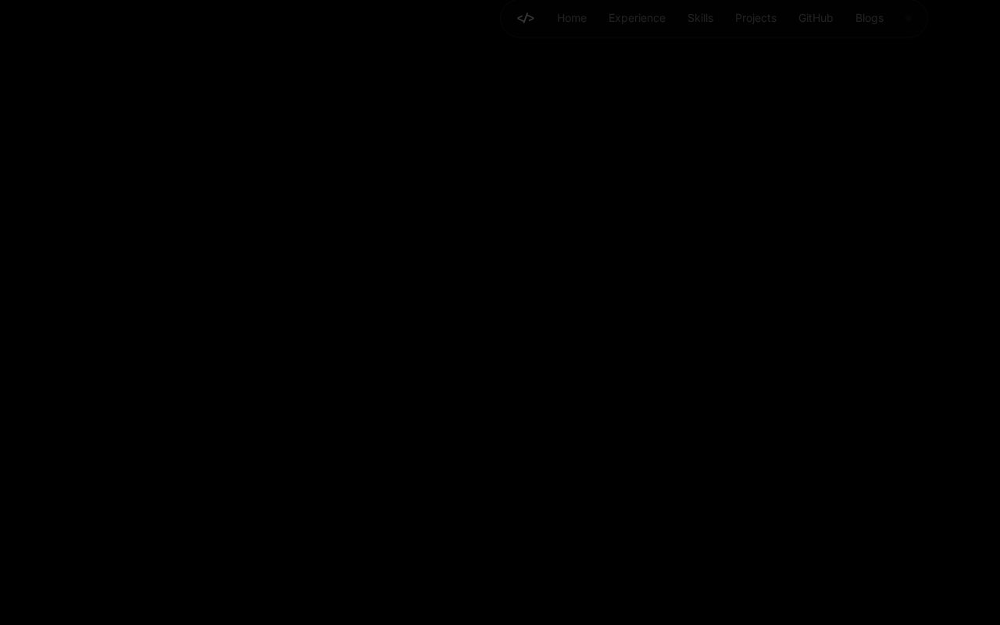
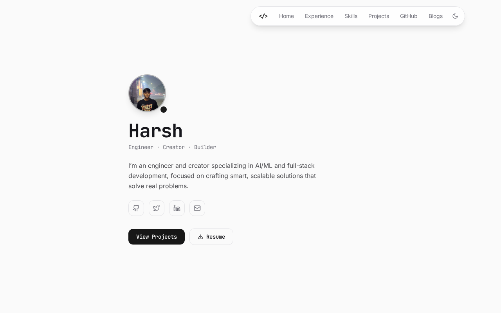
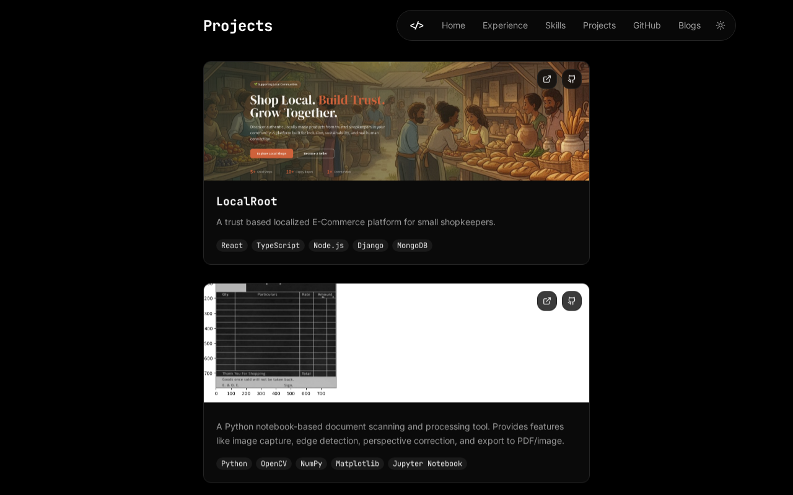
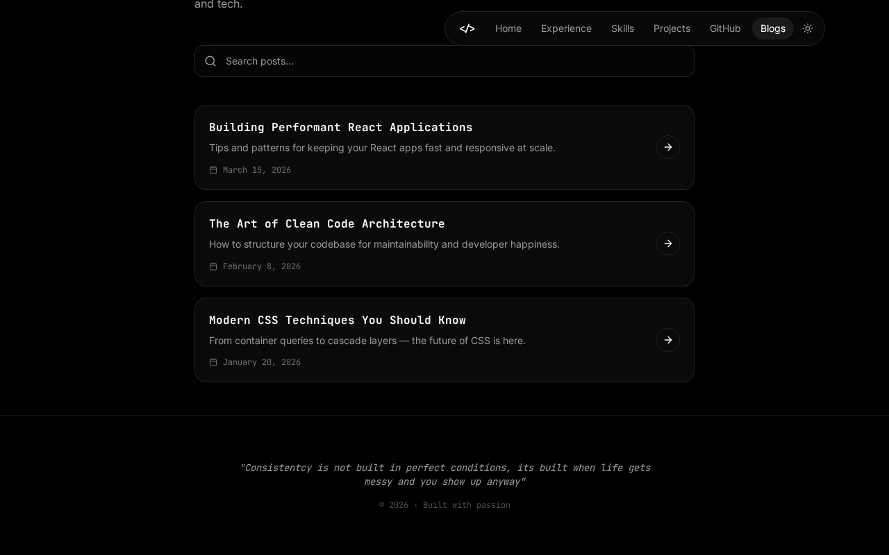

# 🌐 Harsh's Developer Portfolio & Blog

A premium, modern, and highly interactive developer portfolio featuring a dynamic blog, GitHub statistics integration, custom interactive charts, and animations. Built using React, TypeScript, Tailwind CSS, and Vite.

---

## ✨ Features

- **🌓 Dynamic Theme Toggle:** Seamless switching between polished Light and Dark modes.
- **📱 Responsive Layout:** Crafted with a mobile-first design, optimized for all screen sizes.
- **📊 Interactive GitHub Dashboard:** Custom GitHub stats widget and interactive Contribution Graph.
- **✍️ Integrated Blog Engine:** Read article previews and full blog posts with a clean reading interface.
- **🎨 Motion & Micro-interactions:** Powered by Framer Motion for smooth, premium-feel transitions.

---

## 📸 Screenshots

Here is a preview of the application in action:

| ☀️ Light Theme (Home) | 🌙 Dark Theme (Home) |
|:---:|:---:|
|  |  |

| 📁 Projects Showcase | ✍️ Personal Blog |
|:---:|:---:|
|  |  |

---

## 🛠️ Tech Stack

This project is built using modern web technologies:

*   **Core:** [React](https://react.dev/) + [TypeScript](https://www.typescriptlang.org/)
*   **Build Tool:** [Vite](https://vitejs.dev/)
*   **Styling & UI Components:** [Tailwind CSS](https://tailwindcss.com/) + [Shadcn UI](https://ui.shadcn.com/) (Radix UI primitives)
*   **Animations:** [Framer Motion](https://www.framer.com/motion/)
*   **Icons:** [Lucide React](https://lucide.dev/)
*   **Charts & Graphs:** [Recharts](https://recharts.org/)

---

## 📂 Project Structure

The project is structured as a monorepo workspace for easy management:

```
├── assets/                  # Screenshot assets for README
├── frontend/                # Frontend application source
│   ├── public/              # Static assets (favicons, manifest, robots)
│   └── src/
│       ├── assets/          # Project assets (images, icons)
│       ├── components/      # Reusable UI components (Hero, Navbar, Skills, Projects, etc.)
│       ├── hooks/           # Custom React hooks
│       ├── lib/             # Utility configurations (cn, etc.)
│       ├── pages/           # Page containers (Index, Blogs, BlogPost, NotFound)
│       ├── App.tsx          # Router setup and global providers
│       └── index.css        # Tailwind directives and CSS variables
├── package.json             # Root package workspace definition
└── README.md                # This file
```

---

## 🚀 Getting Started

### Prerequisites

Ensure you have **Node.js** (v18.x or higher) and **npm** (v9.x or higher) installed.

### Installation

Clone the repository and install all dependencies from the root directory:

```bash
# Clone the repository
git clone https://github.com/h5rsh/h5rsh-portfolio.git
cd h5rsh-portfolio

# Install dependencies for all workspaces
npm install
```

### Development

To start the local development server:

```bash
# Start frontend dev server
npm run dev
```

This will boot up the Vite dev server, typically running at **`http://localhost:8080`**.

### Production Build

To compile the application for deployment:

```bash
# Build production bundle
npm run build
```

The output will be generated inside the `frontend/dist` directory, optimized and ready to be served.
